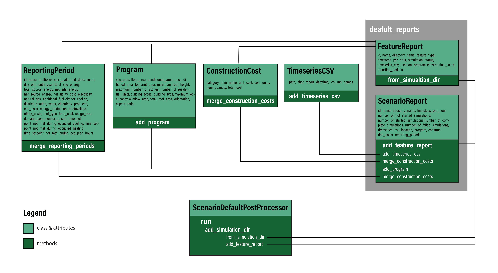

The Scenario Post-Processor aggregates results from each Feature simulation. This process requires specific OpenStudio Reporting Measure be run for each Feature to generate required simulation reports (e.g. timeseries CSV data for specific outputs, specific metrics). Instructions for creating a new reporting measure to generate the Feature reports can be found in the [Feature report](feature_reports.md) section. These individual simulation results should be aligned with the final desired aggregated results. For example, if users decide to customize the reporting measure to report 15-minute timestep results, additional methods should be developed to allow the Post-Processor to aggregate data at this timestep.

Currently, the default Scenario Post-Processor and its corresponding OpenStudio Reporting Measures are implemented in the `Scenario Gem`.  Additional Scenario Post-Processors and OpenStudio Reporting Measures can be implemented in other OpenStudio Extension Gems. Users can use the `Scenario Gem` as a guide for developing their own Post-Processor or they can customize this Gem to report and Post-Process the desired new results. The current Scenario Post-Processor which is used in this example project rake file is the `default_post_processor`, which is an object of `ScenarioDefaultPostProcessor` class.

```ruby
default_post_processor = URBANopt::Scenario::ScenarioDefaultPostProcessor.new(baseline_scenario)
scenario_result = default_post_processor.run
scenario_result.save
```

This `defaults_post_processor` aggregates Feature reports into Scenario-level results by leveraging methods of the [default_reports](https://github.com/urbanopt/urbanopt-scenario-gem/blob/develop/lib/urbanopt/scenario/default_reports.rb) file. This file includes classes that are developed in the default_reports [folder](https://github.com/urbanopt/urbanopt-scenario-gem/tree/develop/lib/urbanopt/scenario/default_reports). Each of these classes corresponds to a component in the default_reports [schema](https://github.com/urbanopt/urbanopt-scenario-gem/blob/develop/lib/urbanopt/scenario/default_reports/schema/scenario_schema.json). This schema describes all the main components of the default reports (reporting_period, program, constructon_cost, etc.) and their attributes. The Figure below describes the architecture of the Post-Processor and illustrates the class hierarchy and main methods which are leveraged by this Post-Processor to aggregate Feature reports into a Scenario report. However, advanced users should also refer to the [Scenario documentation](../advanced_documentation/advanced.md), which includes the schema and Rdocs describing all methods and classes used to aggregate the properties of a Feature report. Users can edit these methods or add new methods that extend or customize the PostProcessor functionality(e.g. reporting and aggregating new properties of interest).


