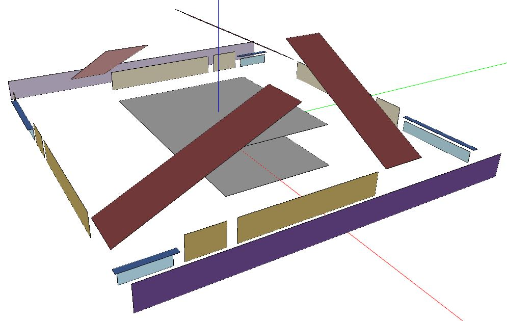

Residential building energy models in URBANopt<sup>&trade;</sup> are created using the [OpenStudio-HPXML](https://github.com/NREL/OpenStudio-HPXML) workflow.
For every residential building feature found in the geojson file, an [HPXML](https://hpxml.nrel.gov) file is built to represent each living unit of the building.
In the case of a single-family detached building (which is the only type of low-rise residential building supported at this time), one HPXML file is built to represent the single unit.
HPXML files are built based on feature information contained in the geojson file as well as on sets of default assumptions contained in:
* clothes_dryer.tsv
* clothes_washer.tsv
* cooling_system.tsv
* dishwasher.tsv
* enclosure.tsv
* heat_pump.tsv
* heating_system.tsv
* mechanical_ventilation.tsv
* refrigerator.tsv
* water_heater.tsv

(See below for more information on controlling how these assumptions are made.)
A translator measure is then applied to the HPXML file to constuct an OpenStudio(R) building model.

## Supported Building Types

Currently, "Single-Family Detached" is the only low-rise residential building type supported (mid-rise and high-rise multifamily building prototypes can be found in the commercial building workflows).
The current plan is for future URBANopt releases to include "Single-Family Attached" and low-rise "Multifamily" capabilities.

### 1. Single-Family Detached

Building surfaces are stored in HPXML without 3D coordinates. An example geometry rendering for a translated HPXML file is given below.



#### GeoJSON Schema

The URBANopt geojson schema differentiates between sets of required and optional fields for "Single-Family Detached" residential buildings:

* Required fields:

  1. floor_area (i.e., conditioned floor area)
  2. number_of_stories_above_ground
  3. number_of_stories (includes foundation stories)
  3. number_of_bedrooms
  4. foundation_type: `slab`, `crawlspace - vented`, `crawlspace - unvented`, `basement - unconditioned`, `basement - conditioned`, `ambient`
  5. attic_type: `attic - vented`, `attic - unvented`, `attic - conditioned`, `flat roof`

* Optional fields:

  1. system_type: combinations of `electric resistance`, `furnace`, `boiler`, `central air conditioner`, `room air conditioner`, `evaporative cooler`, `air-to-air heat pump`, `mini-split heat pump`, `ground-to-air heat pump`
  2. heating_system_fuel_type: `electricity`, `natural gas`, `fuel oil`, `propane`, `wood`
  3. template (see below)

An example "Single-Family Detached" building feature snippet is shown below.

```
{
  "type": "Feature",
  "properties": {
    "id": "1",
    "geometryType": "Rectangle",
    "name": "New Building_1",
    "type": "Building",
    "floor_area": 3000,
    "building_type": "Single-Family Detached",
    "number_of_stories_above_grade": 1,
    "number_of_stories": 1,
    "number_of_bedrooms": 4,
    "foundation_type": "slab",
    "attic_type": "attic - vented",
    "system_type": "Residential - furnace and central air conditioner",
    "heating_system_fuel_type": "natural gas"
  }
```

### 2. Single-Family Attached 

The current plan is for this capability to become available in a **future** release.

### 3. Low-Rise Multifamily

The current plan is for this capability to become available in a **future** release.

## Customizable Template

An optional template enumeration may be specified for each feature in the geojson.
Enumerations that are applicable to residential buildings:

- `Residential IECC 2006 - Customizable Template Sep 2020`
- `Residential IECC 2009 - Customizable Template Sep 2020`
- `Residential IECC 2012 - Customizable Template Sep 2020`
- `Residential IECC 2015 - Customizable Template Sep 2020`
- `Residential IECC 2018 - Customizable Template Sep 2020`

If no template enumeration is specified, argument values will be defaulted according to the [documentation](https://openstudio-hpxml.readthedocs.io/en/latest/hpxml_to_openstudio.html) for the HPXMLtoOpenStudio translator measure.
In general, these defaults are based on ANSI / RESNET / ICC Std. 301 (2006).

Otherwise, argument values will be set according to [these lookup files](https://github.com/urbanopt/urbanopt-example-geojson-project/tree/develop/example_project/mappers/residential) that span across the following categories:

* enclosure (insulation levels, air leakage, etc.)
* HVAC systems (heating/cooling types, efficiencies, etc.)
* appliances (refrigerator, clothes washer, etc.)
* mechanical ventilation
* water heater

All argument values for the previous categories may be customized by manually adjusting values in the lookup files.
The enumeration names include "Residential IECC 20XX" because a variety of enclosure, window, duct insulation, and whole-home air leakage assumptions are based on the different IECC model code years to illustrate how templates can be used to approximate different levels of efficiency.
Note that not all possible assumptions have been aligned with IECC requirements (e.g., see above regarding defaults), but the users can further customize these templates as needed for specific projects.
