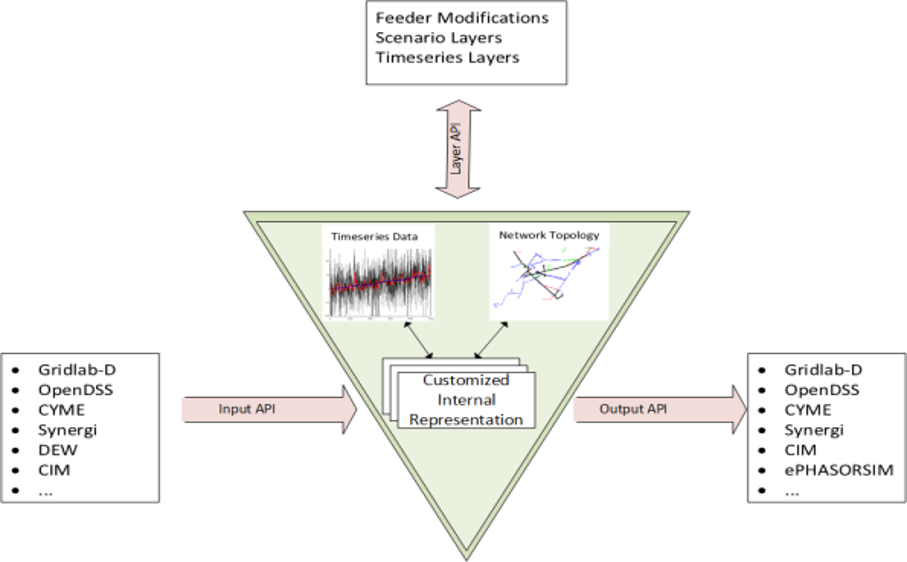
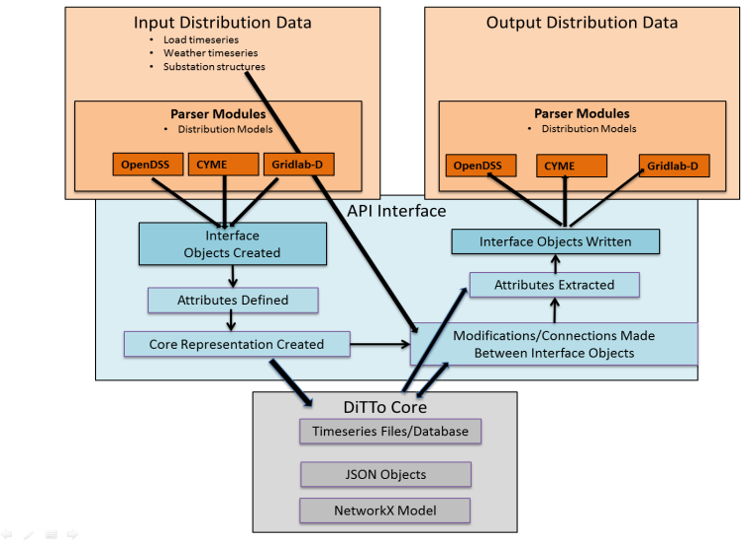
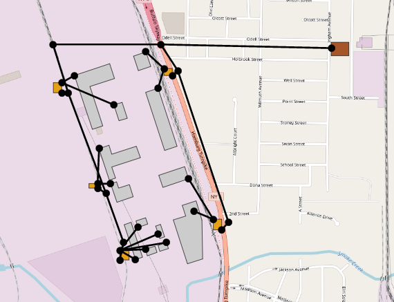

## OpenDSS

OpenDSS is an open-source tool that is popular for simulating electrical distribution systems. It captures several important components of the electrical infrastructure which connects substations to customers; including power lines, electrical nodes, loads, transformers, PV systems, capacitors and regulators among others. OpenDSS simulates powerflow through an electrical network for steady-state loading conditions. The simulations can then be used to determine infrastructure shortcomings that might arise from redesigning a district system. The URBANopt framework focuses on four key metrics; transformer overloads, line overloads, over-voltages and under-voltages. Simulated electrical behavior outside of industry standards will be used to flag impractical district system designs and inform the changes required to guarantee reliable electrical operations.

## DiTTo Conversion Tool
There are several popular modelling tools for representing electrical distribution networks, each of which represents the system in a different way. Some popular open source and commercial solvers include; OpenDSS, GridLAB-D, CYME, Syneri, DEW, PowerFactory among others. Converting between the formats used by these  can be a time-intensive and fraught process. The **DI**stribution **T**ransormation **TO**ol (DiTTo) is an open-source and many-to-many conversion tool written in python that has been developed by NREL to simplify converting data between distribution models, and is available [here](https://github.com/NREL/ditto/).



 DiTTo contains an API that characterizes different electrical equipment types (junctions, lines, transformers etc.) and each of their attributes.  It also contains functionality to modify and analyze network data once it has been read into the API. DiTTo also contains reader and writer modules which exchange data with the API. A reader module parses data from a model data file and extracts the important network information into the API. A writer module takes the network information from the API, and writes a model data file format, so it can be simulated by that electrical modelling tool. The interactions between the reader, writer and API is shown below. 



The DiTTo repository contains an OpenDSS reader and writer to import data from OpenDSS files into the API, and to export data in the API to OpenDSS. However, customized readers and writers can be built to pass data formats that are currently not supported in the DiTTo repository. For URBANopt, geojson files are used to describe district system layouts and timeseries csv files are used to describe load and solar profiles. The [urbanopt-ditto-reader](https://github.com/urbanopt/urbanopt-ditto-reader/tree/master/reader) repository contains a module to parse the relevant URBANopt data into DiTTo, allowing the OpenDSS files to be written by the OpenDSS writer already supported in DiTTo.  

## Conversion Inputs
#### Geojson data
 The electrical layout of an URBANopt model  is represented in the URBANopt geojson file. Electrical data is represented as part of the district system. Currently the electrical equipment of lines, junctions, transformers, capacitors and substations are supported through the user interface. The user can add and connect electrical equipment to represent a potential layout of a district system's distribution system. The user then adds equipment identifiers for transformers, capacitors and lines. The labels describe information such as the type of transformer, or the wire types that are used in the line. An example with a substation, lines and transformers is shown below and is included in the [urbanopt-ditto-reader](https://github.com/urbanopt/urbanopt-ditto-reader/blob/master/example/urbanopt_example.json) repository.



#### Electrical Database
The geojson file does not contain details of the electrical equipment - only equipment identifiers are included. However, OpenDSS requires detailed electrical characteristics for every component in the network (e.g. wire resistance, phase, ampacity GMR, diameter etc). Key electrical information for several equipment types has been identified in a preliminary json dataset which is included in the  [urbanopt-ditto-reader](https://github.com/urbanopt/urbanopt-ditto-reader/blob/master/example/electrical_database.json) repository. This dataset will be expanded upon in future releases.

#### Timeseries Data
URBANopt can be run with a base scenario for each building. Each building feature contains a feature report file titled "default_feature_report.csv", which contains timeseries information for the district feature including total load consumption. This information can be read into DiTTo to provide timeseries loads for the electrical network.

If REopt is used to re-evaluate building designs and consumptions, a separate file titled "feature_report_reopt.csv" is generated for each building feature. This contains timeseries information including total load consumption and  solar power generated. If the DiTTo converter uses the REopt loads, the updated timeseries dataset is attached to OpenDSS, and PV objects created as required. This can be seen in the example provided in teh [urbanopt-ditto-reader](https://github.com/urbanopt/urbanopt-ditto-reader/blob/master/example/baseline_scenario/baseline_scenario) repository.

## Converting and Running OpenDSS

The [urbanopt-ditto-reader](https://github.com/urbanopt/urbanopt-ditto-reader) contains three pieces:

 - Sample data needed to convert an URBANopt scenario into OpenDSS located [here](https://github.com/urbanopt/urbanopt-ditto-reader/tree/master/example) 
 - The DiTTo module to read the URBANopt format located [here](https://github.com/urbanopt/urbanopt-ditto-reader/tree/master/reader)
 - A file to call the DiTTo modules to perform the conversion, and run OpenDSS with the outputs located [here](https://github.com/urbanopt/urbanopt-ditto-reader/blob/master/convert.py)

Once the [DiTTo](https://github.com/NREL/ditto/) repository has been cloned, a conversion can be run using the `convert.py` script. A config file is used as an input argument for the conversion script and specifies the location of the timeseries load data, equipment file, where the opendss output will be written to, the geojson input file, the location of the DiTTo repository and whether REopt outputs will be used over the default URBANopt timeseries data. An example is shown below
```
{
    "urbanopt_scenario": "example/baseline_scenario/baseline_scenario",
    "equipment_file": "example/electrical_database.json",
    "opendss_folder": "example/baseline_scenario/opendss",
    "geojson_file": "example/urbanopt_example.json",
    "ditto_folder":"../ditto",
    "use_reopt": true
}
```
The conversion script is then run with 
`python convert.py config.json`

This uses the reader module to perform convert the URBANopt data into OpenDSS files which are written in the `opendss_folder` location from in the config file. The subfolder `dss_files` contains the `.dss` files required to run OpenDSS and the subfolder `profiles` contains simplified timeseries data required to run OpenDSS. 

OpenDSS is then run using the python `OpenDSSDirect` module, which runs powerflow for the network created from the input files. The results of the simulation are written the the `results` subfolder of the `opendss_folder` directory.

## Output Data

OpenDSS contains a wealth of information about the electrical network and what the state of all the devices on the network are. The urbanopt-ditto-reader module focuses on 
- Line overloads
- Transformer overloads
- Over-voltages and under-voltages at building features

Overloads are observed when a line or transformer is over 100% of its rated capacity. An overvoltage is a per-unit voltage greater than 1.05 while an undervoltage is a per-unit voltage below 0.95 as per ANSI standards.

In the `results` folder there are folders for Lines, Transformers and Features. Each of these folders contains a csv file titled by the equipment name for each respective equipment type in the network.  Transformer and lines contain fields about loading and whether the device is overloaded. Features contain a field about the voltage and whether the device has an overvoltage or undervoltage. For instance the feature file:
```
Datetime,p.u. voltage,overvoltage,undervoltage
2019/01/01 01:00:00,0.94,False,True
2019/01/01 02:00:00,0.97,False,False
2019/01/01 03:00:00,1.0,False,False
2019/01/01 04:00:00,1.03,False,False
2019/01/01 05:00:00,1.06,True,False
2019/01/01 06:00:00,1.07,True,False
```
indicates that at 01:00, there is an undervoltage detected, while at 5:00 and 6:00 overvoltages are detected.
This information is integrated into the feature reports and used for identifying district systems which need to be re-designed.
