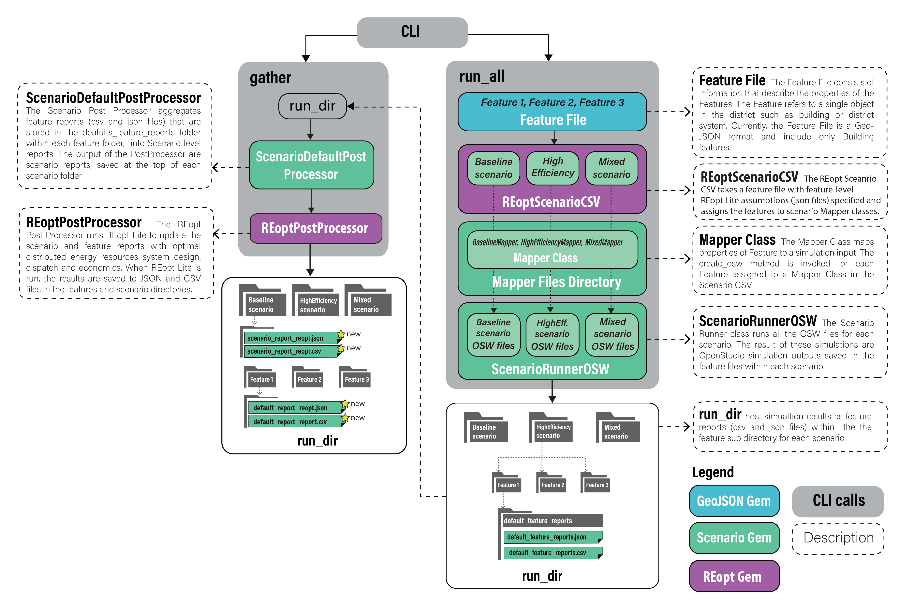
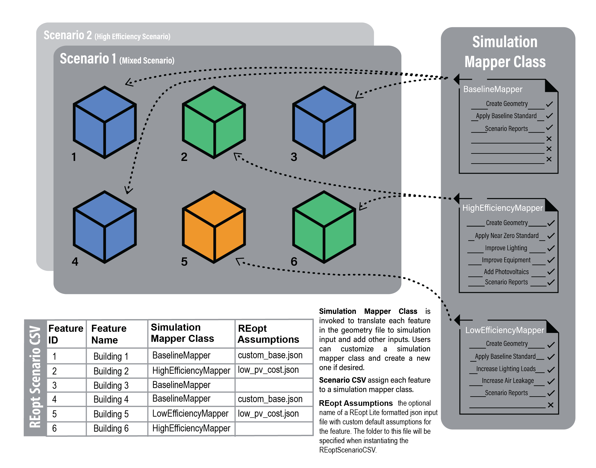

## Intro

CLI commands are used to run and post-process each scenario. Onscreen help is always availabe with `uo --help`

**REopt Lite** optimization happens during the post-processing of each scenario. Two types of REopt optimization are available: _scenario-level_, which optimizes for the aggregate load of the entire district being simulated, and _feature-level_, which optimizes each building's load individually.

## Workflow

The `type` of reopt optimization is specified in the CLI call:

This command allows you to post-process a ScenarioReport in aggregate. This is suitable for community-scale optimizations.

```terminal
  uo process reopt-scenario --scenario baseline_scenario.csv --feature example_project.json  
```

Alternatively, this command allows you to post-process a Scenario for each of its Feature Reports before aggregating into a summary in the Scenario Report. This runs REopt optimization on each building individually.

```terminal
  uo process reopt-feature --scenario baseline_scenario.csv --feature example_project.json  
```

Depending on the `type` of optimization chosen, **REopt Lite** runs on a _**ScenarioReport**_ or _**FeatureReport**_. The resulting `distributed_generation` attributes of that report (including system financial and sizing attributes) are updated as shown in an example below. 

```json
  "distributed_generation": {
      "lcc_us_dollars": 30943,
      "lcc_bau_us_dollars": 40040.0,
      "npv_us_dollars": 9097.0,
      "year_one_energy_cost_us_dollars": 750.3,
      "year_one_demand_cost_us_dollars": 0.0,
      "year_one_bill_us_dollars": 1521.66,
      "total_demand_cost_us_dollars": 0.0,
      "total_energy_cost_us_dollars": 7189.5,
      "year_one_energy_cost_bau_us_dollars": 3407.27,
      "year_one_demand_cost_bau_us_dollars": 0.0,
      "year_one_bill_bau_us_dollars": 4178.63,
      "total_energy_cost_bau_us_dollars": 32649.02,
      "total_demand_cost_bau_us_dollars": 2189.75,
      "total_solar_pv_kw": 0.0,
      "resilience_hours_min": 3.0,
      "resilience_hours_max": 6116.0,
      "resilience_hours_avg": 0.0,
      "probs_of_surviving": [ 0.0027, 0.0027,],
      "probs_of_surviving_by_month": [
        [0.0164,],[0.0164,],[0.0164,],[0.0],[0.0],[0.0],
        [0.0],[0.0],[0.0],[0.0],[0.0],[0.0]],
      "probs_of_surviving_by_hour_of_the_day": [
        [0.0],[0.0],[0.0],[0.0],[0.0],[0.0],
        [0.0],[0.0],[0.0],[0.0],[0.0],[0.0],
        [0.0],[0.0],[0.0],[0.0],[0.0],[0.0],
        [0.0],[0.0],[0.0],[0.0],[0.0],[0.0]],
      "solar_pv": [
        {"size_kw": 8.0124}
      ],
      "wind": [],
      "generator": [],
      "storage": [
        {"size_kw":2.1848, "size_kwh":4619}
      ]
    },
      }
```

Moreover, the following optimal dispatch fields are added to its `timeseries CSV`.

|            new column name                        |  unit  |
| --------------------------------------------------| ------ |
| REopt:ElectricityProduced:Total(kW)               | kW     |
| REopt:Electricity:Load:Total(kW)                  | kW     |
| REopt:Electricity:Grid:ToLoad(kW)                 | kW     |
| REopt:Electricity:Grid:ToBattery(kW)              | kW     |
| REopt:Electricity:Storage:ToLoad(kW)              | kW     |
| REopt:Electricity:Storage:ToGrid(kW)              | kW     |
| REopt:Electricity:Storage:StateOfCharge(kW)       | kW     |
| REopt:ElectricityProduced:Generator:Total(kW)     | kW     |
| REopt:ElectricityProduced:Generator:ToBattery(kW) | kW     |
| REopt:ElectricityProduced:Generator:ToLoad(kW)    | kW     |
| REopt:ElectricityProduced:Generator:ToGrid(kW)    | kW     |
| REopt:ElectricityProduced:PV:Total(kW)            | kW     |
| REopt:ElectricityProduced:PV:ToBattery(kW)        | kW     |
| REopt:ElectricityProduced:PV:ToLoad(kW)           | kW     |
| REopt:ElectricityProduced:PV:ToGrid(kW)           | kW     |
| REopt:ElectricityProduced:Wind:Total(kW)          | kW     |
| REopt:ElectricityProduced:Wind:ToBattery(kW)      | kW     |
| REopt:ElectricityProduced:Wind:ToLoad(kW)         | kW     |
| REopt:ElectricityProduced:Wind:ToGrid(kW)         | kW     |


**NOTE**: A REopt Lite solution may contain multiple PV systems. In this case the aggregate generation from all PV systems will be reported in the PV columns.

The figure below describes the workflow that takes place on implementing the `run` and `process` CLI commands.



The following figure represents how Simulation Mapper Classes can be assigned to different
Features from the FeatureFile in the Scenario CSV.


