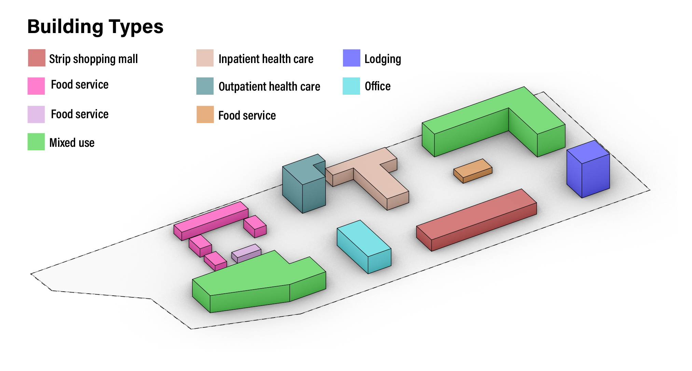

## Before you begin!

To run a project you will need an internet connection so the REopt Gem can access the REopt Lite API.

You'll also need an API key from the [NREL Developer Network](https://developer.nrel.gov/]). Copy and paste your key in to the _developer_nrel_key_._rb_ file in root directory of the urbanopt-example-reopt-project repo, then save the file:

    DEVELOPER_NREL_KEY = '<insert your key here>'

## Example Project    
To run an example project incorporating REopt Lite functionality, clone the [example project](https://github.com/urbanopt/urbanopt-example-reopt-project) to your local machine. Next, run the following commands to set up the Rake tasks defined in the Rakefile of the current working directory:

1. `bundle install` to ensure all dependencies in your [Gemfile](https://github.com/urbanopt/urbanopt-example-reopt-project/blob/master/Gemfile) are available
2. `bundle update` to update your gems to the latest available versions
3. `bundle exec rake openstudio:runner:init`  
   This command creates a `runner.conf` file that can be used to configure URBANopt. We
   recommend setting `num_parallel` based on the number of the number of Features you have or cores in
   your CPU.
4. `bundle exec rake` to execute [Rake tasks](reopt_post_processing.md) as described in the next section.

