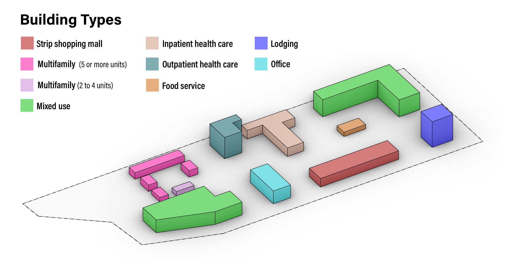

We have created a *hypothetical project* that you can experiment with to demonstrate example URBANopt functionality. This project is intended to showcase the URBANopt version 0.1.0 capabilities, not represent a realistic development.

To prepare URBANopt, move to the top-level directory of the [example project](https://github.com/urbanopt/urbanopt-example-geojson-project) you just forked and cloned in the previous step. Run the following commands to set up the Rake tasks defined in the Rakefile of the current working directory.

1. `bundle install` to ensure all dependencies in your Gemfile are available
1. `bundle update` to update your gems to the latest available versions
1. `bundle exec rake openstudio:runner:init`  
This command creates a `runner.conf` file that can be used to configure URBANopt. We recommend setting `num_parallel` to the smaller of the number of Features you have or cores in your CPU.
1. `bundle exec rake <rake task>` to execute [Rake tasks](rake_tasks.md) as described in the next section.

