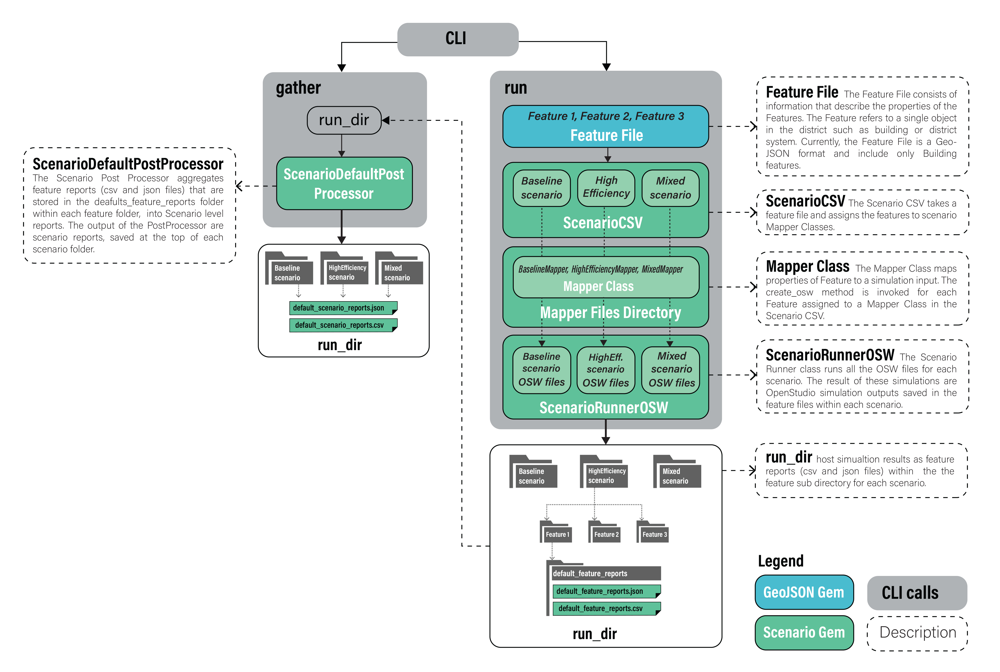

To run URBANopt™, first [install](../installation/installation.md) the project dependencies and the URBANopt Command Line Interface.

Once the CLI is installed, help is available by typing `uo --help` from the command line. Detailed help for each command can be found with `uo <command> --help`

1. Create a project folder in your current directory using:

    ```terminal
    uo create --project-folder <path/to/PROJECT_DIRECTORY_NAME>
    ```

    This creates a project folder containing the [example project](example.md), and downloads related weather files and detailed models to the appropriate folders.

    Create an empty base project folder by using:

    ```terminal
    uo create --empty --project-folder <path/to/PROJECT_DIRECTORY_NAME>
    ```
    
    This creates project folder without an example FeatureFile and an empty weather folder. You can
    download weather files and add to this folder from energyplus.net/weather.

    Overwrite an existing folder by using:

    ```terminal
    uo create --overwrite --project-folder <path/to/PROJECT_DIRECTORY_NAME>
    ```

    This deletes anything in the named folder and creates a fresh project directory. Can be combined with `-e` to overwrite a directory with a new empty URBANopt project directory.

1. Put your [FeatureFile](../overview/definitions.md) in the root of the folder you just created, or use the provided example.
1. **We recommend calling all URBANopt commands from _outside_ the project folder you created, using relative or absolute paths to the relevant files.**

1. There are two ways to create [ScenarioFiles](../overview/definitions.md). One way, which creates a ScenarioFiles for all Features in the FeatureFile based off the example _mappers_, is to run:

    ```terminal
    uo create --scenario-file <path/to/FEATUREFILE.json>
    ```

    Alternatively, to create a ScenarioFile for a single [Feature](../overview/definitions.md), specify the Feature_ID in the arguments as shown here:

    ```terminal
    uo create --scenario-file <path/to/FEATUREFILE.json> --single-feature <FEATURE_ID>
    ```

    If you will be post-processing with **REopt Lite** data, you will need to also now convert your scenario CSV file with:

    ```terminal
    uo create --reopt-scenario-file <path/to/EXISTING_SCENARIO_FILE.csv>
    ```

    This command will create a new scenario CSV (named REopt_scenario.csv by default) that has an extra column to map assumption files to features. Use this scenario CSV file going forward in future steps.

    You may write your own mapper file for your own specific use case as needed, as well as make your own ScenarioFile by hand.  You may also make edits to the ScenarioFiles to mix and match mappers.

1. Simulate energy usage of each feature or for a single Feature by specifying the appropriate ScenarioFile by using:

    ```terminal
    uo run --feature <path/to/FEATUREFILE.json> --scenario <path/to/SCENARIOFILE.csv>
    ```

    **Note:** To simulate energy usage for a scenario that will require additional **REopt Lite** post-processing, run this command instead.

    ```terminal
    uo run --reopt --feature <path/to/FEATUREFILE.json> --scenario <path/to/SCENARIOFILE.csv>
    ```

    Also note that there is a *runner.conf* file automatically created in the project folder.  This file is used to configure the number of features to process in parallel as well as a few other parameters.  Make edits to this file prior to running the above command.

1. If you intent to post process with **REopt Lite** (i.e. using `reopt-scenario`, `reopt-feature`), please now refer to the instructions outlined in [REopt Post Processing](../reopt/reopt_post_processing.md). Otherwise, post-process simulated features into a [Scenario](../overview/definitions.md) report by using `default` as the `type` :

    ```terminal
    uo process --<TYPE> --feature <path/to/FEATUREFILE.json> --scenario <path/to/SCENARIOFILE.csv>
    ```

    Valid `TYPE`s are: `default`, `opendss`, `reopt-scenario`, `reopt-feature`


1. Delete an outdated [Scenario](../overview/definitions.md) run by using:

    ```terminal
    uo delete --scenario <path/to/SCENARIOFILE>
    ```

# Workflow Details

The figure below describes the workflow that takes place for the *run* and *post_process* calls.




The following figure represents how Simulation Mapper Classes can be assigned to different Features from the FeatureFile in the Scenario CSV.


